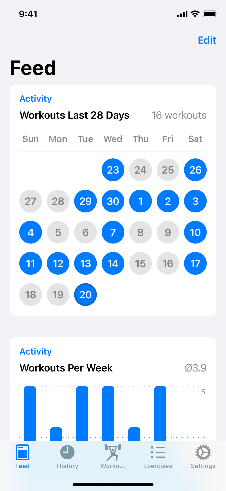
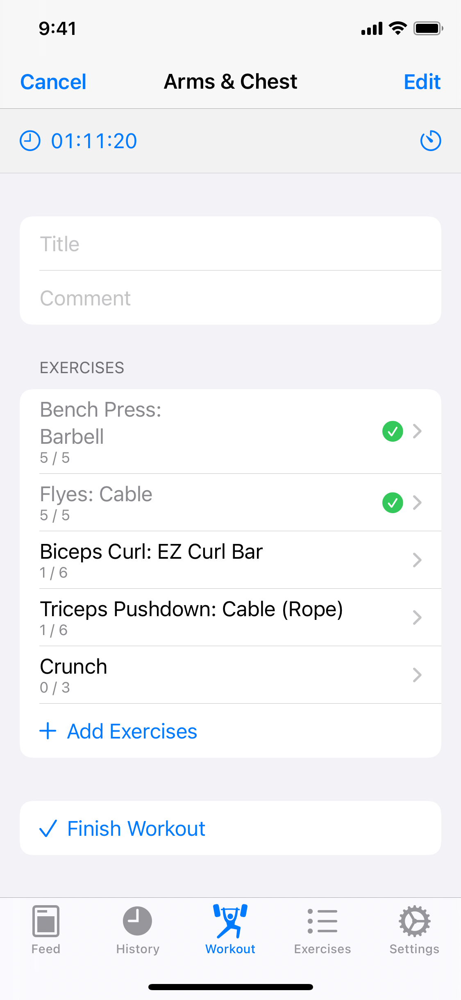
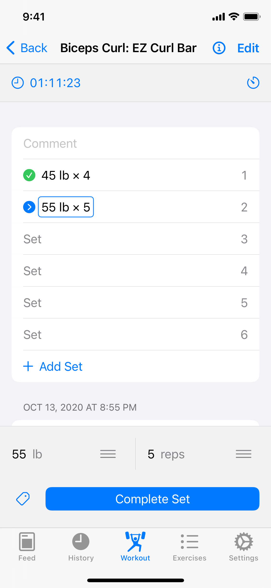

  

  

# Iron

A modern and completely free weightlifting workout tracker for iOS, written in SwiftUI.

|  |  |  |
|-|-|-|

## Building

**Xcode 13** or later is required.

- Select the "Iron" project in the Xcode sidebar
- Under "Targets", select "Iron"
- Change the "Bundle Identifier", "App Group" and "iCloud Container" to something unique like `com.yourname.Iron`
- Go to the "Signing & Capabilities" tab and select your development team under "Signing > Team"
- Repeat the same process for the other targets where applicable
- Build the `Iron` scheme. (Note that due to a bug in Xcode 14 the scheme for the Iron target might not be autocreated and you'll have to create it manually.)
